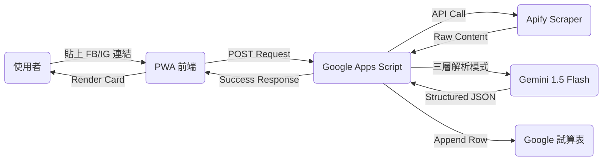

# FoodiePin | 跨平台美食社群收集器 (Technical Whitepaper)

FoodiePin 是一個基於 **Serverless 架構** 的美食資訊自動化系統。它能將 Instagram、Facebook、Threads 等社群平台的貼文連結，透過 AI 深度解析，自動轉化為結構化的餐廳數據，並與 Google Maps 無縫對接。

---

## 🚀 系統核心優勢
1.  **無感解析**：整合 Apify 爬蟲與 Gemini AI，使用者只需貼上連結，系統自動抓取店名、地址與類型。
2.  **極速存取**：利用 Google Apps Script (GAS) 作為後端，無需自建伺服器，實現 0 成本運維。
3.  **三層容錯解析機制**：
    *   **Level 1 (Metadata)**：直接抓取社群平台的地理標籤 (Location Tag)。
    *   **Level 2 (Regex)**：透過精準的標籤 (#) 與符號 (📍) 模式識別，快速提取店名。
    *   **Level 3 (Gemini AI)**：當上述方式失效時，啟動 AI 深度理解文意，精準定位美食資訊。

---

## 🛠️ 技術棧 (Tech Stack)
*   **Frontend**: HTML5, CSS3, Vanilla JavaScript (ES6+), PWA (Service Workers)
*   **Backend**: Google Apps Script (Serverless JS)
*   **Database**: Google Sheets (NoSQL-like implementation)
*   **External APIs**: 
    *   **Apify API**: 負責規避社群平台反爬蟲機制。
    *   **Google Gemini 1.5 Flash**: 負責非結構化文字處理。
    *   **Google Maps API**: 負責地理資訊對接。

---

## 🏗️ 系統架構圖 (Architecture)

---

## 📖 復刻指南 (Setup Guide)

### 1. 後端部署 (Google Apps Script)
1.  建立一個新的 Google 試算表。
2.  進入「擴充功能」 -> 「Apps Script」。
3.  將 `backend/` 目錄下的 `.gs` 代碼貼入。
4.  在「專案設定」中新增以下指令碼屬性：
    *   `GEMINI_API_KEY`: 來自 Google AI Studio。
    *   `APIFY_TOKEN`: 來自 Apify 控制台。
    *   `SPREADSHEET_ID`: 您的試算表 ID。
5.  **重要**：部署為 Web App，設定為 `誰可以存取：所有人`。

### 2. 前端設定 (GitHub Pages)
1.  將本專案 Clone 到本地。
2.  修改 `js/app.js` 中的 `GAS_URL`，填入您剛才部署的 Web App 網址。
3.  推送至 GitHub 並在 Settings 啟動 GitHub Pages。

### 3. 爬蟲對接
本系統預設對接以下 Apify Actor：
*   `apify/instagram-scraper`
*   `apify/facebook-posts-scraper`

---

## 🛡️ 安全性考量
*   **CORS 處理**：後端已實作 `doOptions` 與預檢請求處理，支援跨域連線。
*   **環境變數隔離**：API 金鑰均儲存於 Google 雲端屬性中，前端僅透過安全的 POST 請求呼叫，金鑰不外流。

---
**Author**: Antigravity AI & hub-google
**License**: MIT License
